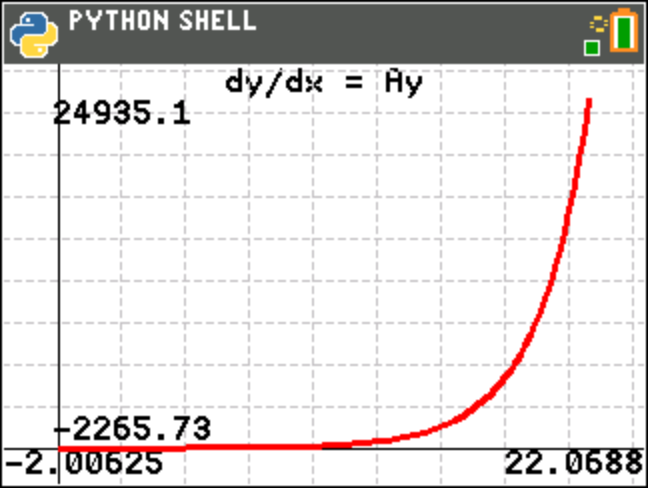

odeex1.py
=========

Chart the solution for dy/dx = Ay using the 4th-order Runge-Kutta method, with the differential equation
supplied as a Python function

.. automodule:: examples.odeex1
   :members:
