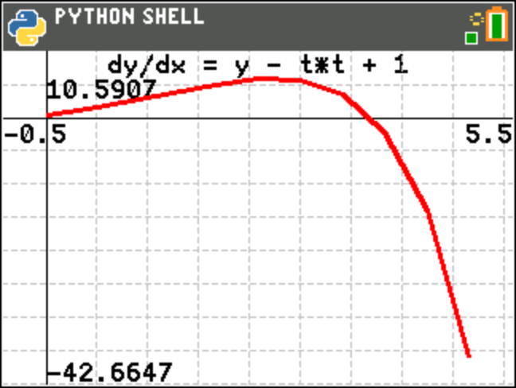

odeex2.py
=========

Chart the solution for dy/dx = y - t^2 + 1 using the 4th-order Runge-Kutta method, with the differential
equation supplied as a Python function

.. automodule:: examples.odeex2
   :members:
