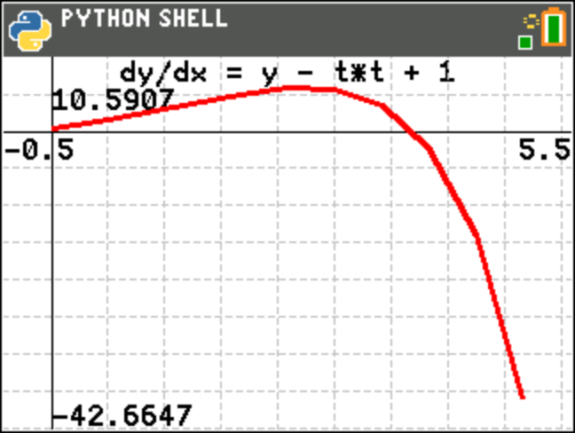

odeex3.py
=========

Chart the solution for dy/dx = yt^2 - y using the predictor-corrector method, with the differential equation
supplied as a Python function:

.. automodule:: examples.odeex3
   :members:
