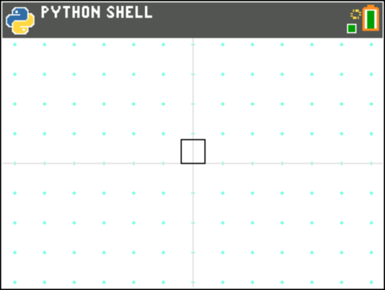

turtplay.py
===========

Replay a string of instructions for TurtleDraw then enter interactive mode. The string that's played back
is "LUURRDDL", that causes the turtle to:

- Move left one step
- Move up two steps
- Move right two steps
- Move down two steps
- Move left one step

This draws a small square in the center of the screen:

As the string doesn't include a Q (quit) instruction, once playback is complete, the turtle will enter
interactive mode.

.. automodule:: examples.turtplay
   :members:
