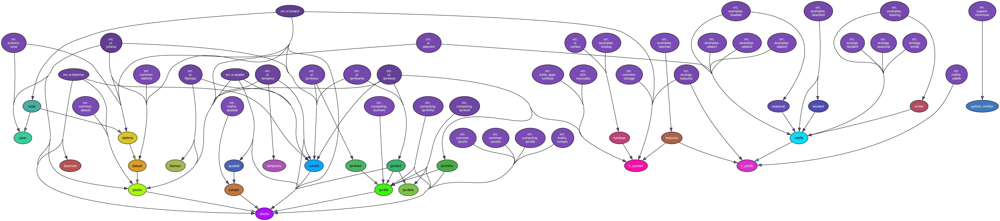

TI-84 CE-T Python Applications and Experiments
==============================================

A collection of Python applications, utilities, and coding experiments developed for the TI-84 Plus CE-T Python Edition graphing calculator.

The repository combines small educational programs, practical utilities, and more exploratory projects built within the constraints of the calculator platform. Topics range from mathematics and science tools through to networking calculations, ecological modelling, and acoustic signal analysis.

The aim of the project is not to produce highly polished “apps”, but to explore what can realistically be achieved on a constrained handheld Python environment while keeping the code understandable, portable, and reasonably efficient.

Current areas include:

- Mathematics and science utilities
    - Small calculators and demonstrations
    - Numerical and graphical experiments
    - Educational coding exercises
- Networking tools
    - IPv4 subnetting helpers
    - Network calculation utilities
    - Reusable subnetting library functions
- Seasonal ecological modelling
    - Simplified ODE-based seasonal models adapted for the TI-84 environment
    - Wildlife detectability and seasonality simulations
    - Graphical rendering of seasonal curves directly on the calculator
- Bat call pulse timing analysis
    - Pulse interval and sequence analysis tools
    - Exploration of time-structure analysis for bat recordings
    - Adaptations of desktop workflows for calculator-scale hardware

The repository also serves as an ongoing exploration of:

- Writing efficient Python for limited hardware
- Reducing memory usage and allocation overhead
- Simplifying numerical methods for embedded-style environments
- Building usable interfaces within the TI-84 graphical system

The programs are intentionally self-contained and avoid external dependencies beyond
the calculator’s Python environment.

Structure
---------

The repository contents can be classified as:

- Library modules, providing implementations of the core algorithms but lacking UIs
- Standalone applications, that implement UIs over the library modules
- Supporting utilities, that are not calculator applications

The *src* folder of the repository is structured as follows:

+-------------+-----------------------------------------------------------------------------+
| Package     | Contents                                                                    |
+-------------+-----------------------------------------------------------------------------+
| common      | Library code implementing cross-cutting concerns                            |
+-------------+-----------------------------------------------------------------------------+
| computing   | IPv4 network details and subnet calculators                                 |
+-------------+-----------------------------------------------------------------------------+
| ecology     | Wildlife seasonal presence/detectability modeling and bat call analysis     |
+-------------+-----------------------------------------------------------------------------+
| examples    | Programmatic examples based on the code in the other packages               |
+-------------+-----------------------------------------------------------------------------+
| maths       | Logic for maths applications and library code                               |
+-------------+-----------------------------------------------------------------------------+
| science     | Logic for science applications and library code                             |
+-------------+-----------------------------------------------------------------------------+
| support     | Supporting utilities                                                        |
+-------------+-----------------------------------------------------------------------------+
| ti_desktop  | Minimal/mock implementations of TI-specific libraries                       |
+-------------+-----------------------------------------------------------------------------+
| turtle_apps | Logic for applications written over the Python "turtle" library             |
+-------------+-----------------------------------------------------------------------------+
| ui          | Standalone applications that wrap the logic contained in the other packages |
+-------------+-----------------------------------------------------------------------------+

The ti_desktop package contains minimal implementations of the TI libraries that allow some of the
applications to be developed, tested and run on a desktop machine. It is not a full implementation
of the TI libraries and contains just sufficient implementation to support the applications in
this repository.

Running the Applications on the Calculator
------------------------------------------

The above graph shows the module dependencies - clicking on the image should display a full-sized version.

Individual modules are shown at the top-level with arrows from each to each of the packages it depends on,
and from them to their dependencies and so on to the top of the hierarchy.

To run one of the applications:

- First, minify the source code using the minimiser (see the section on supporting utilities, below)
- Transfer the minified versions of the application and the packages in its dependency graph to the calculator
- Run the application as normal

Note that some of the applications push the memory constraints of the calculator close to the limit. If an
out-of-memory or memory allocation error is encountered, remove other applications to free up RAM or, *provided
the contents have been safely backed up*, perform a RAM reset on the calculator to clear everything other than
the default applications and operating system. Then, transfer the minified application and its dependencies and
run it again.

.. toctree::
   :maxdepth: 2
   :caption: Library Modules:

   maths/index
   science/index
   ecology/index
   computing/index
   common/index
   turtle_apps/index

.. toctree::
   :maxdepth: 2
   :caption: Applications:

   examples/index
   apps/index

.. toctree::
   :maxdepth: 2
   :caption: Supporting Tools:

   support/index

Indices and tables
==================

* :ref:`genindex`
* :ref:`modindex`
* :ref:`search`
