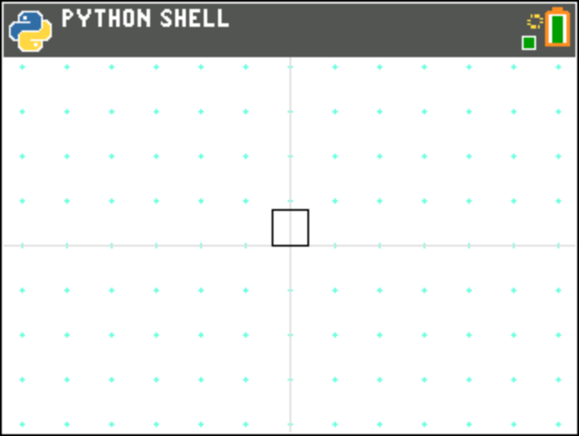

turtdraw.py
===========

TURTDRAW.py implements an interactive wrapper round Python's Turtle drawing library. The following table
summarises the keys used to control the turtle on the calculator, their desktop equivalents and the
character that should be used to achieve that action in a playback string:

+------------------+-------------+-------------+--------------+
| **Action**       | **TI-84**   | **Desktop** | **Playback** |
+------------------+-------------+-------------+--------------+
| Move right       | Right arrow | R           | R            |
+------------------+-------------+-------------+--------------+
| Move left        | Left arrow  | L           | L            |
+------------------+-------------+-------------+--------------+
| Move up          | Up arrow    | U           | U            |
+------------------+-------------+-------------+--------------+
| Move down        | Down arrow  | D           | D            |
+------------------+-------------+-------------+--------------+
| Toggle pen       | P           | P           | P            |
+------------------+-------------+-------------+--------------+
| Replay (history) | H           | H           | H            |
+------------------+-------------+-------------+--------------+
| Reset (clear)    | Clear       | C           | C            |
+------------------+-------------+-------------+--------------+
| Quit             | 2nd + quit  | Q           | Q            |
+------------------+-------------+-------------+--------------+

To run the application in interactive mode, use the following code:

.. code-block::

   from turtdraw import TUrtleDraw

   td = TurtleDraw()
   td.event_loop()

The turtle can also playback a string of actions expressed using the characters summarised in the above
table. For example:

.. code-block::

   from turtdraw import TUrtleDraw

   td = TurtleDraw()
   td.play_string("LUURRDDL")

This example, which is included in the examples as TURTPLAY.py, causes the turtle to:

- Move left one step
- Move up two steps
- Move right two steps
- Move down two steps
- Move left one step

This draws a small square in the center of the screen:

In this example, as the string doesn't include a Q (quit) instruction, once playback is complete, the
turtle will enter interactive mode.

.. automodule:: turtle_apps.turtdraw
   :members:
