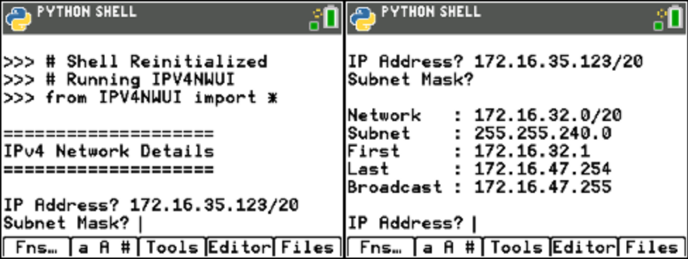

ipv4nwui.py
===========

Interactive wrapper around the IPv4 Network Details calculator.

The application prompts for the IP address for the network and the subnet mask.

The IP address can be entered with the "/n" suffix specifying the number of network bits, in which case the subnet mask can be empty, or without the suffix, in which case the subnet mask is required.

The following image shows an example of the prompts for parameters, on the left, and the output, to the right:

.. automodule:: ui.ipv4nwui
   :members:
