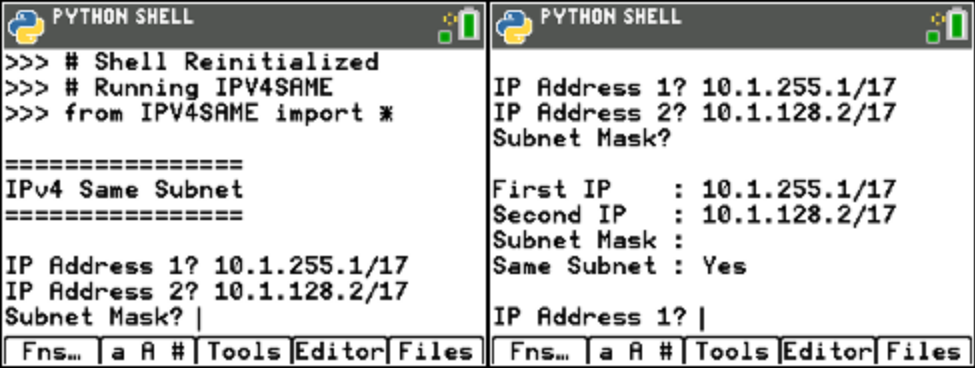

ipv4same.py
===========

Determines if two IP addresses are on the same subnet.

The application prompts for two IP address and the subnet mask.

The IP address can be entered with the "/n" suffix specifying the number of network bits, in which case the subnet mask can be empty, or without the suffix, in which case the subnet mask is required.

The following image shows an example of the prompts for parameters, on the left, and the output, to the right:

.. automodule:: ui.ipv4same
   :members:
