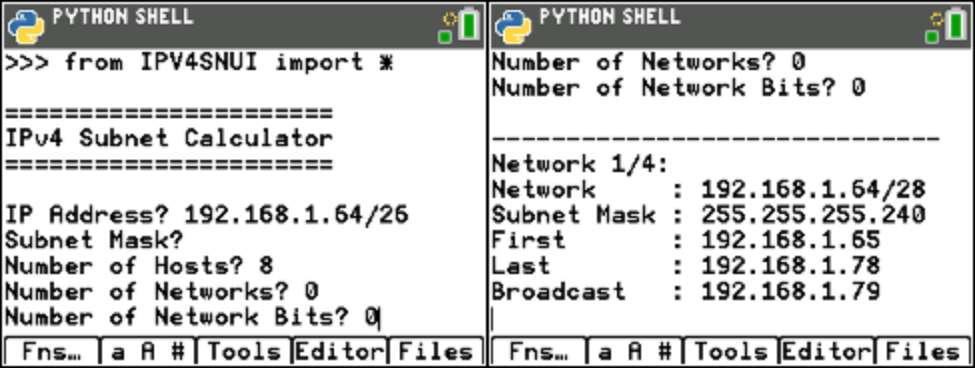

ipv4snui.py
===========

Interactive wrapper around the IPv4 Network Subnet calculator.

The application prompts for the following details:

- IP address for the network to subnet
- Subnet mask
- Number of hosts per subnet, or 0 to calculate for a number of subnets
- Number of networks required, or 0 to calculate for a number of hosts per network

The IP address can be entered with the "/n" suffix specifying the number of network bits, in which case the subnet mask can be empty, or without the suffix, in which case the subnet mask is required.

The following image shows an example of the prompts for parameters, on the left, and the output, to the right:

Once the subnets have been calculated, the following keys can be used to navigate between the details for each available subnet:

+-----------------------------+-------------+-------------+
| **Action**                  | **TI-84**   | **Desktop** |
+-----------------------------+-------------+-------------+
| Move to the next subnet     | Right arrow | R           |
+-----------------------------+-------------+-------------+
| Move to the previous subnet | Left arrow  | L           |
+-----------------------------+-------------+-------------+
| Quit                        | 2nd + quit  | Q           |
+-----------------------------+-------------+-------------+

.. automodule:: ui.ipv4snui
   :members:
