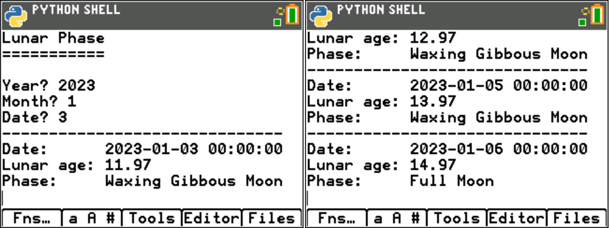

lunarui.py
==========

Interactive view on the lunar cycle from a specified start date. The application
first prompts for the start date and displays the lunar age for that date, as per the
left-hand screenshot, below.

Thereafter, the following keys can be used to move backwards and forwards through the
available dates and to quit the application:

+---------------------------+-------------+-------------+
| **Action**                | **TI-84**   | **Desktop** |
+---------------------------+-------------+-------------+
| Move to the next date     | Right arrow | R           |
+---------------------------+-------------+-------------+
| Move to the previous date | Left arrow  | L           |
+---------------------------+-------------+-------------+
| Quit                      | 2nd + quit  | Q           |
+---------------------------+-------------+-------------+

The dates will "wrap round", covering a 30 day period from the initial start date.

.. automodule:: ui.lunarui
   :members:
