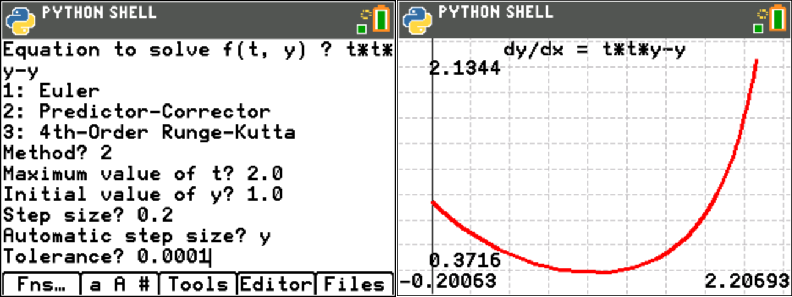

odesolvr.py
===========

Interactive wrapper around the ODELIB ordinary differential equation solver.

The application prompts for the equation to solve, expressed in terms of the independent variable, "t",
and the dependent variable, "y", and the integration parameters. It then solves the equation and either
outputs the data as text or charts it.

The following image shows an example of the prompts for parameters, on the left, and the chart output, to
the right:

Interactive mode doesn't require creation of any additional Python code to call the solver but it suffers
from the disadvantage that the only way to supply the equation is as a string representation which is
evaluated on each step in the solution.

This is slower than the alternative available when using programmatic mode, which is to supply a Python
functon as the equation to solve.

For further details on calling the ODE solver programatically, please refer to the ODELIB.py documentation.

.. automodule:: ui.odesolvr
   :members:
