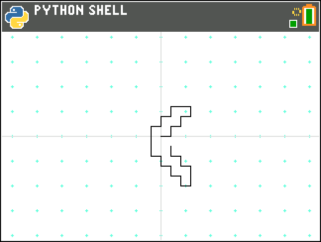

turtleui.py
===========

TURTLEUI.py uses the TurtleDraw() class defined in TURTDRAW.py to implement an interactive UI for the
Python turtle drawing package:

The keypresses used to control the turtle are listed in the documentation for the TURTDRAW.py module.

.. automodule:: ui.turtleui
   :members:
